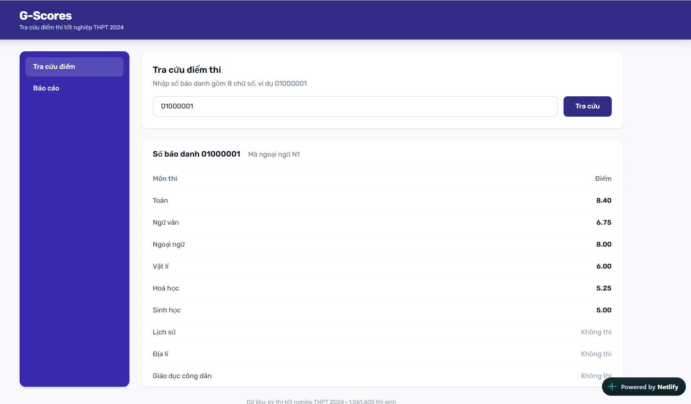
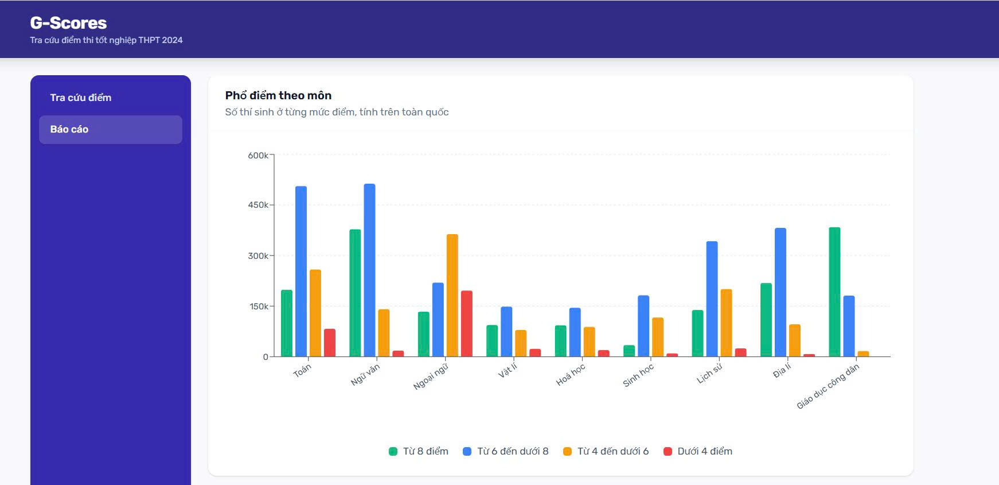
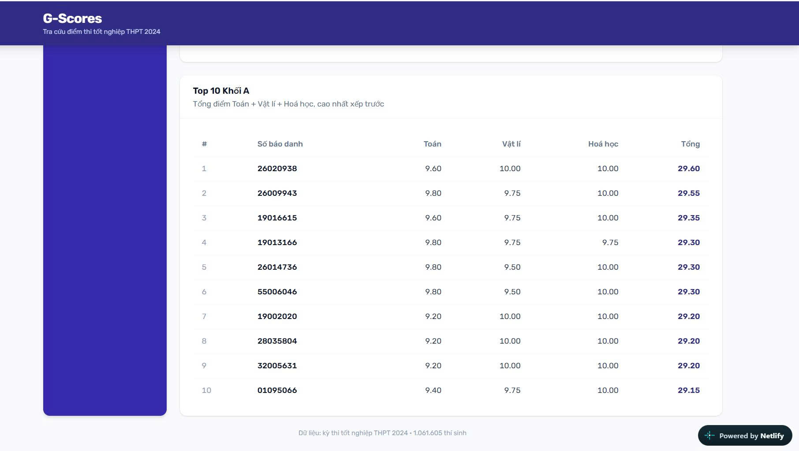

# G-Scores

Look up Vietnamese high school exam results (kỳ thi tốt nghiệp THPT 2024) and see how scores are distributed across the country.

Built for the Golden Owl fullstack intern assignment.

| | |
|---|---|
| **Live demo** | https://spiffy-scone-6eccd2.netlify.app |
| **API** | https://g-scores-bn4j.onrender.com/api |
| **API docs (Swagger)** | https://g-scores-bn4j.onrender.com/api/docs |

> The API runs on Render's free tier, which sleeps after 15 minutes of inactivity.
> An UptimeRobot health check every 5 minutes keeps it awake, so the demo should
> respond immediately. A cold start, if one does happen, takes about 23 seconds.
> Warm responses are around 0.4 s, including the database queries.

**A few things worth a look**

- The seeder went from an extrapolated 56 minutes to 110 seconds — [how](#seeder-performance)
- I expected `Float` to break the leaderboard, measured it, and was wrong — [why I still avoided it](#decimal42-not-float)
- Rank 10 is contested by 8 candidates on the same score — [how the tie is broken](#assumptions)

---

## Features

- **Score lookup** by registration number, with validation on both the client and the server
- **Score distribution chart**: candidate counts per subject across four bands (`>= 8`, `6-8`, `4-6`, `< 4`)
- **Group A leaderboard**: top 10 combined scores of Maths + Physics + Chemistry
- Responsive layout, Swagger docs, CI that runs lint, build and tests on every push

The dataset holds **1,061,605 candidates**.

### Score lookup



Subjects the candidate did not sit are shown as *Không thi*, not as zero. The two are different in the data and are kept apart everywhere.

### Score distribution



### Group A leaderboard



Ranks 7 to 9 all scored 29.20 and rank 10 scored 29.15, which is exactly the tie the ordering has to handle. See [Assumptions](#assumptions).

---

## Tech stack

| Layer | Choice | Why |
|---|---|---|
| Backend | NestJS 12 + TypeScript | Module/service structure keeps the domain layer separate from HTTP |
| Database | PostgreSQL 16 | `numeric` type stores exam scores without floating point error |
| ORM | Prisma 7 | Migrations live in git; the generated client keeps queries type-safe |
| Frontend | React 19 + Vite + TypeScript | |
| Chart | Recharts | Loaded lazily, it is the heaviest dependency in the app |
| Styling | Tailwind CSS 4 | |
| Tests | Vitest (both sides) | Jest cannot `require` the ESM-only Nest 12 packages on Node 22 |

---

## Running it locally

You need Node 20+ and Docker.

```bash
git clone https://github.com/DoanTienTrung/g-scores
cd g-scores

# 1. Start PostgreSQL (host port 5433, so it will not clash with a local install)
docker compose up -d

# 2. Backend
cd backend
npm install
cp .env.example .env
npx prisma generate
npx prisma migrate deploy
npm run seed          # imports 1,061,605 rows, takes about 2 minutes
npm run start:dev     # http://localhost:3000/api

# 3. Frontend, in a second terminal
cd frontend
npm install
cp .env.example .env
npm run dev           # http://localhost:5173
```

The dataset ships with the repo as `dataset/diem_thi_thpt_2024.csv.gz` (8.7 MB), so there is nothing to download.

Tests: `npm test` in either folder, plus `npm run test:e2e` in `backend` (45 unit, 7 e2e, 13 frontend). The e2e tests replace Prisma with a stub, so they need no database and run on CI.

---

## API

| Method | Path | Notes |
|---|---|---|
| `GET` | `/api/health` | Also pings the database |
| `GET` | `/api/students/:sbd` | 8-digit registration number. `404` if unknown, `400` if malformed |
| `GET` | `/api/reports/statistics` | Counts per subject per band |
| `GET` | `/api/reports/top-students?group=A` | Defaults to group A. Unknown group returns `400` |

Every error uses the same shape, so the frontend never has to branch on it:

```json
{
  "statusCode": 404,
  "message": "Không tìm thấy số báo danh 99999999",
  "path": "/api/students/99999999",
  "timestamp": "2026-09-06T10:15:00.000Z"
}
```

Full schemas and a "try it" button are at [`/api/docs`](https://g-scores-bn4j.onrender.com/api/docs).

---

## Assumptions

The brief leaves three things open. These are the calls I made.

**Candidates missing a group A subject are excluded from the leaderboard.** Not treated as scoring zero. Only 343,800 candidates (32.4%) sat all three subjects, and "did not sit the exam" is different from "sat it and scored 0" — both exist in the data.

**Rank 10 needs a tiebreaker.** Sorting by total alone is not enough: ranks 1-9 are decided, but rank 10 falls inside a group of **8 candidates tied on 29.15**. Without a second sort key Postgres returns an arbitrary one of them and the list can change between identical requests. The query orders by `total DESC, sbd ASC`.

**Band boundaries are inclusive at the bottom.** A score of exactly `8.0` is in the top band, `6.0` in the second, `4.0` in the third. This follows the wording in the brief. There are unit tests on each boundary because that is where an accidental `>` instead of `>=` would hide.

---

## Design decisions

### Everything below came out of looking at the data first

Before designing the schema I wrote `scripts/explore-dataset.mjs` and ran it over the full file. It is in the repo, so every number here is reproducible:

```bash
node scripts/explore-dataset.mjs
```

### One table, not three

I kept one row per candidate with nine nullable score columns, instead of normalising into `students` / `subjects` / `scores`.

| | One table | Normalised |
|---|---|---|
| Rows | 1.06M | 6.4M |
| Size | ~130 MB | ~680 MB |
| Seed time to Render | 10 min | ~60 min |

The exam results never change, so the usual reason to normalise — avoiding update anomalies — does not apply. The attribute set is fixed at nine subjects set by the ministry, and splitting a small fixed set of attributes into key-value rows is the EAV anti-pattern. Render's free tier caps storage at 1 GB, and the normalised version was uncomfortably close.

The cost is that adding a subject needs a migration. That is a trade I was willing to make for read-only data.

### `Decimal(4,2)`, not `Float`

Scores are exact decimal quantities, the same category as money.

I did expect float to produce visible artifacts like `27.200000000000003` in the leaderboard, so I measured it across all 343,800 group A totals. **It never happened** — Physics and Chemistry are marked in steps of 0.25, and multiples of 0.25 are exact in binary.

I still used `Decimal`, because that conclusion only holds for this particular set of marking steps. I did not want the correctness of the system to depend on a coincidence.

Scores also stay as strings all the way from the CSV into Prisma. Converting through `Number` first would reintroduce exactly the error `Decimal` exists to avoid.

### Subjects live in one place

`src/subjects/subject.registry.ts` is the only file that knows there are nine subjects, what they are called, and which column each maps to. Four other places read from it:

- the seeder, when parsing CSV columns
- the lookup API, when labelling each score
- the statistics API, when listing subjects
- the leaderboard query, when building the `SELECT`

Adding a subject is one line there plus a migration. Nothing else changes.

Score groups work the same way. Adding group B would be:

```ts
B: new SubjectGroup('B', 'Khối B', [SUBJECTS.toan, SUBJECTS.hoaHoc, SUBJECTS.sinhHoc]),
```

and no other code change, because the leaderboard builds its SQL from `group.columns`.

I deliberately did not create a subclass per subject. All nine share the same banding rule, so subclasses would carry no behaviour — dead code. The OOP here is encapsulation (the four thresholds live inside `Subject.classifyLevel` and nowhere else) and composition (`SubjectGroup` holds subjects rather than extending them).

### Building SQL from column names, safely

The leaderboard query is assembled from the group's columns, which sounds dangerous. The user-supplied value is only ever a group code, and it has to match the registry whitelist before anything else happens:

```
?group=A  →  findGroup()  →  SubjectGroup | undefined → 400
                                  ↓ .columns
                    ['toan','vat_li','hoa_hoc']   ← constants in code
                                  ↓
                              into the SQL
```

The user's string never reaches the query. There is a test asserting that `?group=A'; DROP TABLE exam_results--` returns 400 **and that the database was never called**.

### Statistics are computed once, at seed time

Counting a million rows on every request is not something Render's free tier can do. The seeder builds the 9 × 4 distribution during the same single pass over the file and writes 36 rows. The reports endpoint reads those 36 rows.

Response time is **0.22 s** instead of a full table scan.

The trade is that changing the data means re-seeding. For a published, frozen exam result set that costs nothing.

### Seeder performance

I wrote the naive version first — read the file into memory, one `INSERT` per row — and measured it on 10,000 rows so I did not have to sit through the whole thing.

| | Rows/second | 1.06M rows | Peak memory |
|---|---|---|---|
| Naive (`create` per row) | 316 | **56 min** (extrapolated) | 169 MB |
| Streaming + batched `createMany` | **9,589** | **110 s** | |
| Same code, writing to Render | 1,707 | 622 s | |

**30x faster.** Two independent problems had to be fixed: too many round trips (batching) and holding the file in memory (streaming). Fixing only one would not have helped much.

Batch size is **2,000**, picked by measuring eight values from 250 to 20,000. It is not "bigger is better" — throughput peaks around 2,000 and drops by half at 20,000, because Postgres has to parse an enormous statement and bind tens of thousands of parameters.

The gap between 9,589 and 1,707 rows/second is the same code over a network link to Singapore. That is round-trip latency, not database speed — which is the whole reason batching matters.

`seed-naive.ts` is still in the repo so the baseline can be checked.

### Raw SQL would have been faster, and I did not use it

I measured a hand-written multi-row `INSERT` at 24,096 rows/second, 2.6x faster than `createMany`. I kept the ORM version: the brief asks for ORM usage, and 110 seconds is already fast enough. Recording the measurement seemed more useful than taking the faster path.

---

## What I would do next

- The report panels re-fetch on every visit; a small cache would help.
- Group A is the only group implemented, since it is the only one asked for. The registry is ready for more.
- Docker Compose only brings up Postgres, not the whole stack.
